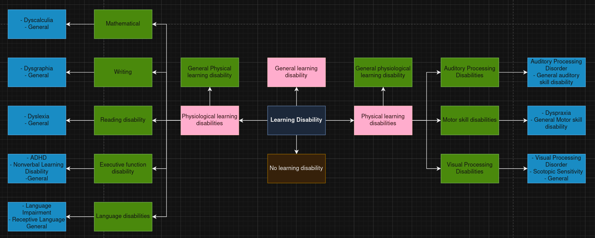
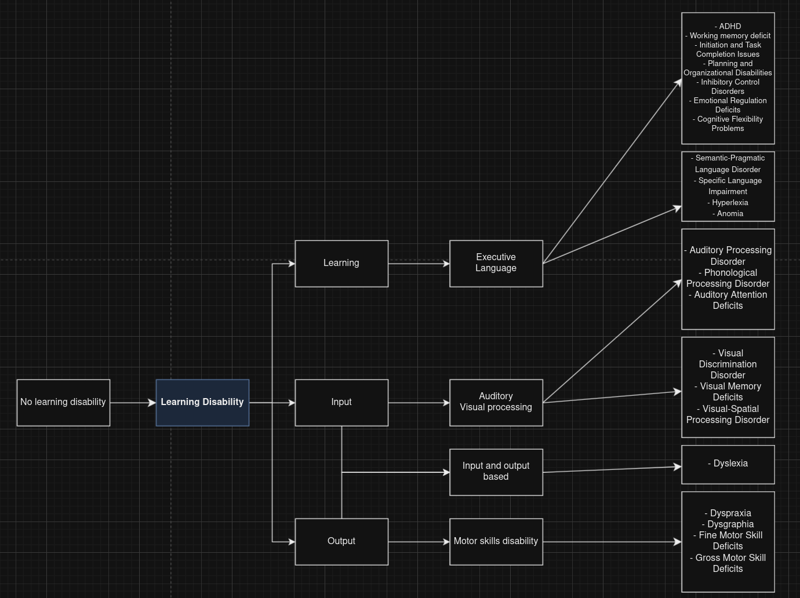

# Use of knowledge base to classify learning disabilities

## Initial idea

## Method we are actually going with

## Introduction
The purpose of this project is to use a knowledge base to classify learning disabilities. The knowledge base is a graph that contains information about learning disabilities and their symptoms. The graph is used to classify learning disabilities based on the symptoms that a person exhibits. The project uses a rule-based system to classify learning disabilities based on the symptoms that a person exhibits. The project also uses a knowledge base to provide information about learning disabilities and their symptoms. The project is implemented in Python using the NetworkX library to create and manipulate the graph.

## Method of Classification
I will ask questions
and allow the user to input answers on a scale of 1 to 5 with 5 being maximum agreement and 1 being minimum agreement.
The questions will be based on the symptoms of learning disabilities.
The answers will be used to classify the learning disability based on the symptoms that the user exhibits.
The classification will be done
using a rule-based system
that uses the knowledge base to determine the learning disability based on the symptoms that the user exhibits.
The questions will be weighted and diagnoses
will be made based on the answers provided by the user if they reach certain thresholds.

                {
                    "name": "Acquiring of new skills",
                    "question": "Do you struggle with acquiring new skills or knowledge despite instruction and practice?"
                },
                {
                    "name": "Broad difficulties across areas",
                    "question": "Are there broad difficulties across multiple areas (e.g., reading, writing, math) rather than isolated challenges with understanding or expression?"
                },
                {
                    "name": "Broad difficulties across areas",
                    "question": "Are there broad difficulties across multiple areas (e.g., reading, writing, math) rather than isolated challenges with understanding or expression?"
                },
                {
                    "name": "Performance gap",
                    "question": "Do you display a gap between your potential (e.g., IQ) and actual performance in academic settings?"
                },
                {
                    "name": "Consistency of difficulties",
                    "question": "Are your difficulties consistent over time, regardless of changes in teaching methods or supports?"
                },
                {
                    "name": "Difficulty interpreting information",
                    "question": "Do you experience difficulty interpreting or processing information you receive (e.g., through listening, reading, observing)?"
                },
                {
                    "name": "Difficulty understanding instructions",
                    "question": "Do you struggle with understanding or retaining instructions, especially complex or multi-step ones?"
                },
                {
                    "name": "Sensory processing issues",
                    "question": "Are there specific issues with sensory processing, such as distinguishing similar sounds or recognizing visual patterns?"
                },
                {
                    "name": "Need for repetition",
                    "question": "Do you need frequent repetitions or simplifications to comprehend basic information?"
                },
                {
                    "name": "Difficulty with communication",
                    "question": "Do you understand concepts but struggle to communicate or demonstrate your knowledge?"
                },
                {
                    "name": "Written or verbal expression difficulty",
                    "question": "Do you have difficulty with written or verbal expression, resulting in responses that are slow, incomplete, or incoherent?"
                },
                {
                    "name": "Motor skills impact on expression",
                    "question": "Are there issues with motor skills affecting your ability to write, type, or physically express what you know?"
                },
                {
                    "name": "Frustration in communication",
                    "question": "Do you experience frustration when trying to communicate thoughts due to an inability to articulate ideas clearly?"
                }